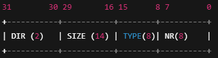

## ioctl
read/write 로 부족한 제어용 인터페이스

read write는 바이트 스트림 중심

cmd를 통해서 장치/ 동작 구분, 데이터 크기/ 방향 포함 구분 가능. 안전하게 처리 가능

하지만 드라이버에는 이런 요구가 있음.

+ 동작 모드 변경
+ 내부 변수 설정
+ 상태값 질의
+ 하드웨어 초기화
+ 기능 ON/OFF

``` c
long(*unlocked_ioctl)(struct file *file, unsigned int cmd, unsigned long arg);

```
file 열린객체
cmd ioctl 명령 번호
arg 유저 데이터 주소

cmd 
|dir| size| type | nr |

+ 데이터 방향
+ 데이터 크기
+ 매직넘버
+ 명령번호

#### 유저코드

``` c
#define MY_MAGIC 'M'
#define IOCTL_SET_VAL _IOW(MY_MAGIC, 1, int)

int val = 123;
ioctl(fd, IOCTL_SET_VAL, &val);  // 유저가 호출

```

#### 커널 코드

``` c

static long my_ioctl(struct file *file,
                     unsigned int cmd,
                     unsigned long arg)
{
    int tmp;

    // cmd 해석
    int dir  = _IOC_DIR(cmd);   // write → user → kernel
    int type = _IOC_TYPE(cmd);  // 'M'
    int nr   = _IOC_NR(cmd);    // 1
    int size = _IOC_SIZE(cmd);  // 4

    switch (nr) {
        case 1: // IOCTL_SET_VAL
            if (dir & _IOC_WRITE) {
                copy_from_user(&tmp, (int __user *)arg, size);
                device_value = tmp;
            }        
            break;
    }

    return 0;
}


/// copy_from_user 

unsigned long copy_from_user(void *to, const void __user *from, unsigned long n);

// 0 이면 성공, 복사 실패한 바이트 수

unsigned long copy_to_user(void __user *to, const void *from, unsigned long n);

// 0이면 성공 , 복사 실패한 바이트 수

```


