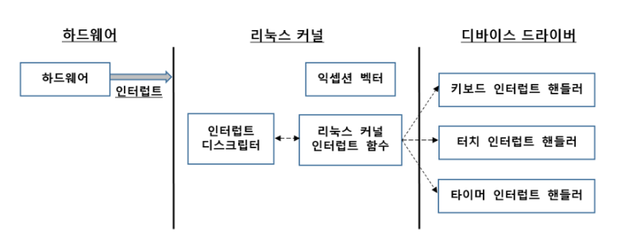

### 폴링

+ CPU 가 계속 물어보는 방식

+ CPU 낭비 

### interrupt

+ 디바이스가 CPU를 부르는 방식

디바이스 -> Interrupt request 라인 -> cpu

cpu는 레지스터 상태 저장후 커널 모드로 전환

+ 벡터 - CPU가 특정 이벤트 발생시 점프할 주소 또는 목록 

cpu는 익셉션 벡터를 보고 점프하고, 인터럽트 디스크립터를 보고 인터럽트 핸들러 호출

https://austindhkim.tistory.com/category/%EB%A6%AC%EB%88%85%EC%8A%A4%20%EC%BB%A4%EB%84%90%EC%9D%98%20%EA%B5%AC%EC%A1%B0%EC%99%80%20%EC%9B%90%EB%A6%AC/%EC%9D%B8%ED%84%B0%EB%9F%BD%ED%8A%B8%EC%99%80%20%EC%9D%B8%ED%84%B0%EB%9F%BD%ED%8A%B8%20%ED%9B%84%EB%B0%98%EB%B6%80

IRQ 서브시스템으로 추상화를 진행했는데 더 자세히 나중에 봐야될듯