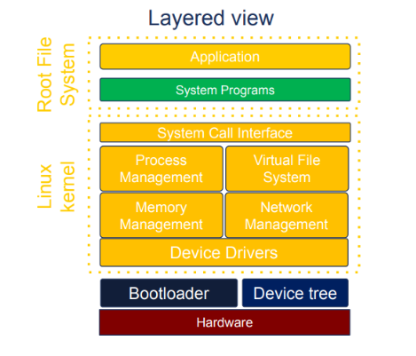

## 임베디드 리눅스

임베디드 리눅스 4요소

+ 툴체인

+ 부트로더

+ 커널

+ 루트 파일 시스템

#### 툴체인

+ 소스코드를 타깃 장치에서 실행할 수 있는 실행 파일로, 컴파일러, 링커, 런타임 라이브러리를 포함하는 컴파일 도구의 집합이다.

+ 표준 GNU 툴체인

+ Binutils - 어셈블러와 링커를 포함하는 바이너리 유틸리티의 집합

+ GCC - C, C++등 여러 언어를 위한 컴파일러이다. 공통 백엔드를 사용해 어셈블러 코드를 만들고, GNU 어셈블러로 넘긴다.

+ C 라이브러리 - posix 규격에 기반을 둔 api로 응용 프로그램에서 운영체제 커널로 연결되는 주요인터페이스이다.

#### 부트로더

+ 시스템을 basic level로 초기화하고 커널을 로드하는 두 가지 주요 작업을 실행한다.

+ 부트 순서

1. 롬 코드 (read only memory code), 칩상에 저장됨, 1단계 끝나면 spl이 sram에 존재하고 롬코드는 spl 코드의 시작으로 점프

2. secondary program loader - 메모리 컨트롤러와 tpl을 dram에 로드함. 롬 코드처럼 사전에 프로그램된 플래시 저장장치시작부터 오프셋을 이용해 프로그램을 읽음.

3. Tertiary Program Loader - u-boot나 bare box같은 완전한 부트로더 실행 . 유지보수 작업을 수행할 수 있는 간단한 cli있음. 3단계가 끝나면 커널이 메모리에서 시작되길 기다리고 있음.

##### 장치트리(Device Tree)
+ 하드웨어 자원을 초기화 하기 위해 정보를 저장해놓음

+ 컴퓨터 시스템의 하드웨어 요소를 정의하는 유연한 방법

+ 부트로더가 로드해서 커널에 넘기는 것

+ 장치트리를 따로 로드할 수 없는 부트로더를 위해 커널 이미지 자체에 포함시킬 수도 있긴 함

#### 커널 

+ 자원관리와 하드웨어 인터페이스 담당

+ 커널은 특정 하드웨어 구성에 맟춰지는데 장치트리를 이용하면, 일반적인 커널을 만들고 장치트리의 내용을 통해 특정 하드웨어에 맞춰지도록 할 수 도있다.

###### 커널 작동 순서

+ 커널 초기화에서 사용자 공간으로 이행하기 위해, 커널은 루트 파일 시스템을 마운트하고 , 루트 파일시스템에 있는 프로그램을 실행한다. 이는 램디스크를 통하거나 블록 장치상의 실제 파일시스템을 마운트함으로써 이뤄진다.

+ res_init() 함수는 PID 1인 첫 번째 thread를 만들고 kernel_init()  코드 실행.

#### 루트 파일 시스템

+ 커널이 부팅 후 가장 먼저 접근하는 필수 파일들의 집합, 유저공간을 시작하기위해 반드시 필요

+ 커널은 부트로더부터 포인터로 전달된 initramfs나, root= 매개변수를 통해 커널 커맨드라인에 지정된 블록 장치를 마운트함으로써 루트 파일 시스템을 구한다.

+ init: 일련의 스크립트를 실행함으로써 모든 것을 시작시키는 프로그램

+ shell: init과 기타 프로그램이 호출하는 shell 스크립트를 실행하기 위해 필요

+ daemon: daemon은 다른 프로그램에게 서비스를 제공하는 백그라운드 프로그램이다. syslogd(system log daemon)와 sshd(secure shell daemon)가 있다. init 자체도 데몬으로, 다른 
데몬들을 시작하는 서비스를 제공한다.

+ 공유 라이브러리: 대부분의 프로그램들은 공유 라이브러리와 링크되는데, 이들 라이브러리는 루트 파일시스템에 존재해야한다.

+ 구성 파일: init과 기타 데몬용 구성 파일들은 일련의 텍스트 파일로, 보통 /etc 디렉토리에 저장된다.

+ 장치 노드: 다양한 장치 드라이버에 접근할 수 있게 해주는 특수 파일들

+ /proc과 /sys: 커널 자료 구조를 디렉토리와 파일의 계층구조로 나타내는 2개의 가상 파일시스템. 여러 프로그램과 라이브러리 함수들이 proc과 sys에 의존한다.

+ 커널 모듈: 커널의 일부를 모듈로 구성했다면, 루트 파일시스템(보통 /lib/modules/[kernel_version])에 설치되어야 한다.

#### 디렉토리 레이아웃

+ /bin: 모든 사용자에게 필수적인 프로그램들

+ /dev: 장치 노드와 기타 특수 파일들

+ /etc: 시스템 구성

+ /lib: 필수 공유 라이브러리 (예: C 라이브러리를 이루는 것들)

+ /proc: proc 파일 시스템

+ /sbin: 시스템 관리자에게 필수적인 프로그램들

+ /sys: sysfs 파일시스템

+ /tmp: 임시 파일이나 휘발성 파일들을 담아두는 곳

+ /usr: /usr/bin, /usr/lib, /usr/sbin에 각각 추가 프로그램, 라이브러리, 시스템 관리 
유틸리티가 담겨있다. 시스템을 부팅할 때 필요한 것을 담고 있어서는 안 된다.

+ /var: 실행 중 변경될 수도 있는 파일과 디렉토리(예: 로그 메시지, 그 중 일부는 부트 뒤에도 남아있어야함)를 담고 있다.

#### UEFI
